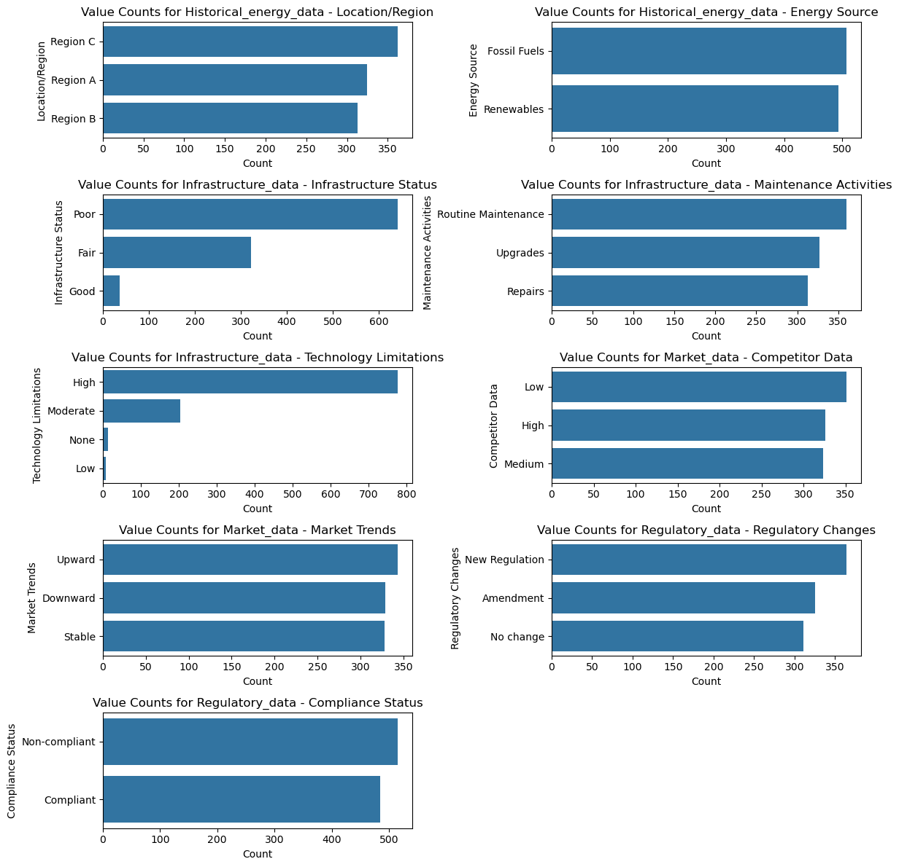
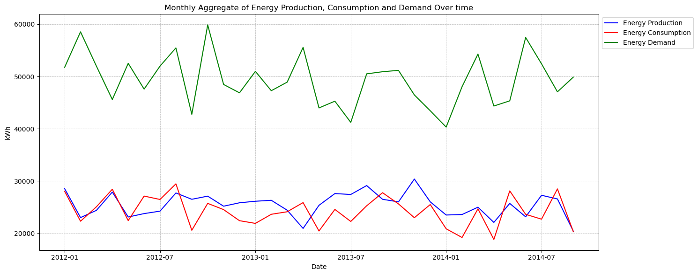
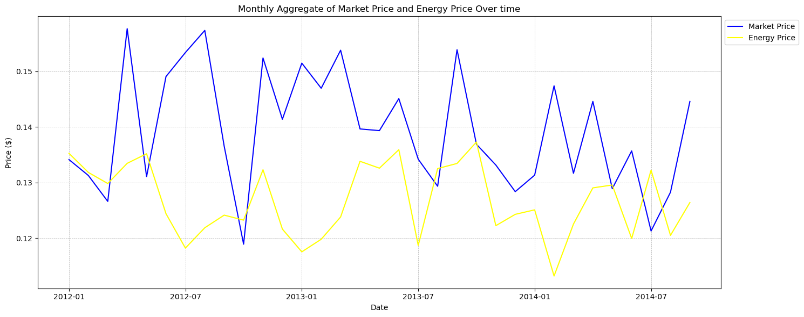
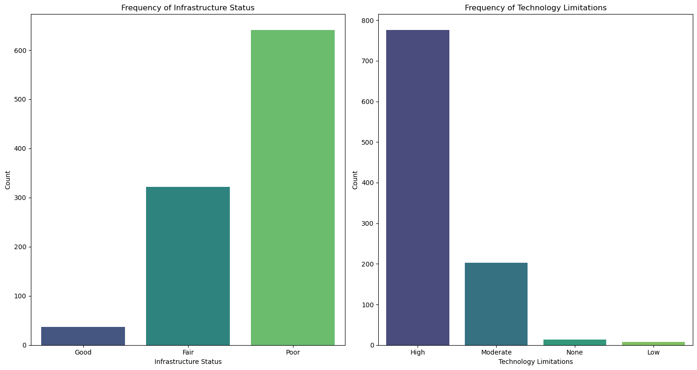
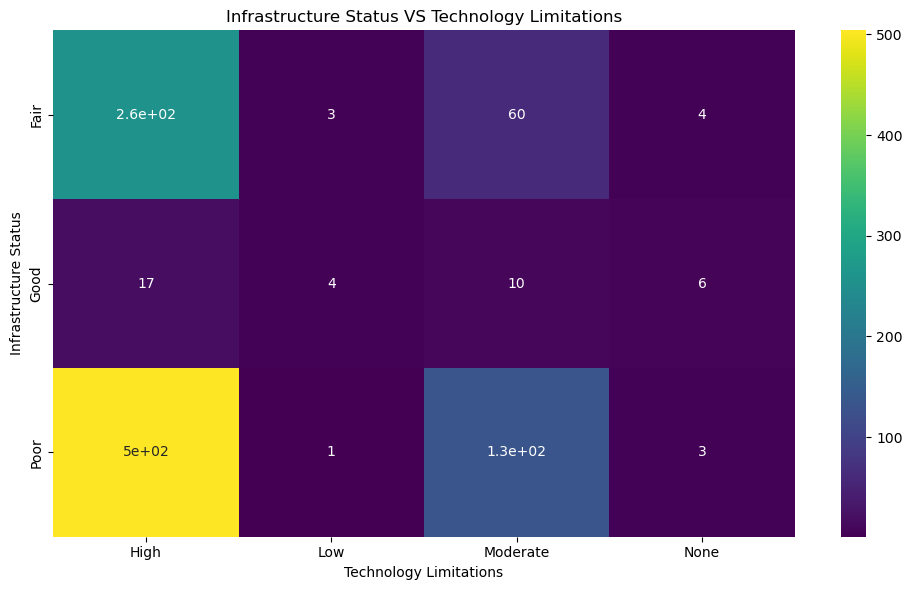
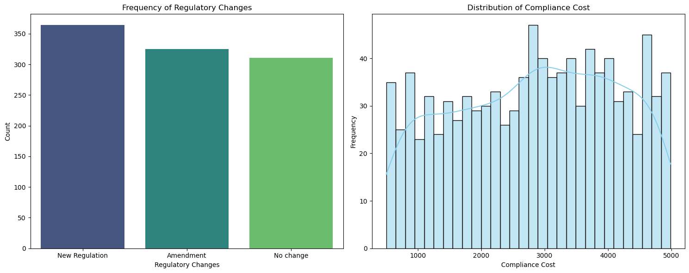
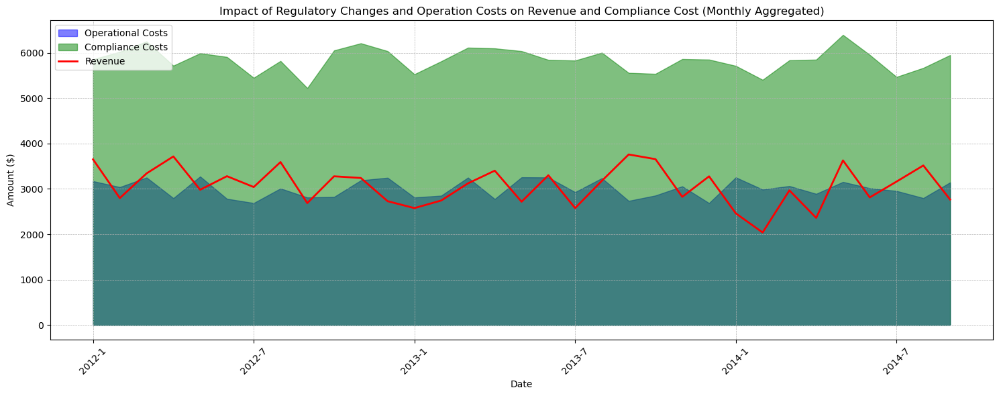
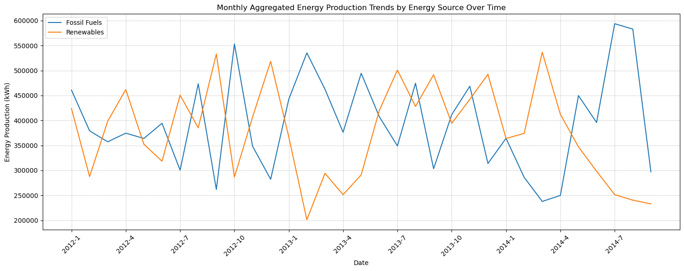

# Energy Market Resilience Analysis for Energix Enterprise

## Table of Contents

- [Project Overview](#project-overview)
- [Business Objectives](#business-objectives)
- [Datasets Used](#datasets-used)
- [Tools Used](#tools-used)
- [Data Cleaning and Preparation](#data-cleaning-and-preparation)
- [Categorical Feature Analysis](#categorical-feature-analysis)
- [Time-Series Analysis](#time-series-analysis)
  - [Energy Demand, Production, and Consumption Over Time](#energy-demand-production-and-consumption-over-time)
  - [Market Price vs. Energy Price](#market-price-vs-energy-price)
  - [Market Price vs. Energy Demand Correlation](#market-price-vs-energy-price)
- [Infrastructure and Technology Analysis](#infrastructure-status-and-technnology-limitations-analysis)
- [Regulatory Changes and Compliance Costs](#regulatory-change-and-compliance-cost)
  - [Impact on Revenue](#impact-of-regulatory-changes-and-operational-cost-on-revenue)
- [Competition from Renewables](#analyzing-competition-from-other-renewable-energy-providers)
- [General Insights](#general-insights)
- [Resilience Planning and Recommendations](#resilience-planning-and-recommendations)
- [Next Steps](#next-steps)
- [Final Thought](#final-thought)


# Project Overview

Energix Enterprise is a major electricity generator and distributor operating across multiple regions with both fossil fuel and renewable energy assets. Recent disruptions in the energy market - including fluctuating demand, rising renewable competition, regulatory pressures, and aging infrastructure - have put operational stability and profitability at risk.

This project aims to analyze historical energy data to assess market vulnerabilities, uncover inefficiencies, and provide strategic recommendations for resilience, compliance, and growth.

# Business Objectives
- **Resilience Planning:** Identify potential disruption points and build a robust response strategy.

- **Production & Pricing Optimization:** Leverage data to optimize production and pricing strategies.

- **Infrastructure Gap Analysis:** Detect the impact of outdated technology and infrastructure on operations.

- **Regulatory Impact Assessment:** Quantify the financial and operational cost of regulatory compliance.

- **Competition Analysis:** Understand the effects of renewable energy trends on market share.

### Datasets Used

| Dataset                     | Description                                                                 |
|----------------------------|-----------------------------------------------------------------------------|
| `Historical_energy_data.csv` | Time series data on energy demand, consumption, pricing, production, and costs |
| `Market_data.csv`            | Market pricing, demand trends, and competitor positioning                  |
| `Infrastructure_data.csv`    | Infrastructure status, maintenance activities, and technology limitations   |
| `Regulatory_data.csv`        | Regulatory changes, compliance status, and associated compliance costs      |


### Tools Used

- Language: Python

- Libraries: pandas, numpy, matplotlib, seaborn

- Notebook: Jupyter Notebook

### Data Cleaning and Preparation
Initial data inspection revealed that the 

- Technology Limitations column in the `Infrastructure_data` dataset had 13 missing values. These null values were imputed with the value `None.`

- The `Date/Time` columns across all datasets were also standardized to the `YYYY-MM-DD` format to ensure consistency for future merges and time-series analysis.

- Feature Engineering: Created derived columns (Revenue, Combined Infrastructure Status)

### Categorical Feature Analysis

Visualized all categorical fields across datasets (e.g., infrastructure status, competitor strength, energy sources) to understand operational and market distribution patterns.



- **Location/Region & Energy Source:** The company's operations are spread across three main regions (Region A, B, and C) and use a balanced mix of fossil fuels and renewables.

- **Infrastructure & Technology:** A significant portion of the company's infrastructure is in a Poor state, and a large number of entries indicate High technology limitations.

- **Competition & Market Trends:** The company faces competitive pressures from providers with varying strategies, and market trends show a mix of upward, downward, and stable periods.

- **Regulatory Changes & Compliance:** The data shows a high frequency of new regulations and amendments, with the company frequently being non-compliant.

## Time-Series Analysis
### Energy Demand, Production, and Consumption Over Time

I used this code to examine the trends in the energy demand, production and consumption from the `Historical_energy_data`

```Historical_energy_data["Month"] = Historical_energy_data["Date/Time"].dt.month
Historical_energy_data["Year"] = Historical_energy_data["Date/Time"].dt.year

#Create new column 'Year-Month' For easy plotting

Historical_energy_data["Year-Month"] = Historical_energy_data["Date/Time"].dt.to_period('M')

#Aggregate data on a monthly basis

monthly_data = Historical_energy_data.groupby("Year-Month").mean(numeric_only=True)

plt.figure(figsize = (15,6))

sns.lineplot(data = monthly_data, x=monthly_data.index.astype(str), y="Energy Production (kWh)", label = "Energy Production", color = "blue", linestyle = '-', ci = None)
sns.lineplot(data = monthly_data, x=monthly_data.index.astype(str), y="Energy Consumption (kWh)", label = "Energy Consumption", color = "red", linestyle = '-', ci = None)
sns.lineplot(data = monthly_data, x=monthly_data.index.astype(str), y="Energy Demand", label = "Energy Demand", color = "green", linestyle = '-', ci = None)

plt.title("Monthly Aggregate of Energy Production, Consumption and Demand Over time")
plt.xlabel("Date")
plt.ylabel("kWh")
plt.legend(loc= "upper left", bbox_to_anchor = (1,1))
plt.grid(True, which= "both", linestyle ="--", linewidth=0.5)

#setting labels
labels = monthly_data.index.astype(str).to_list()
n=6
plt.xticks(labels[::n], rotation = 360)

plt.tight_layout()
plt.show()

```

Result:



Analysis of the `Historical_energy_data` reveals that energy demand often surpasses energy production at various points in time. This highlights a key vulnerability in the company's ability to meet market needs consistently.

Interestingly, Energix has High Demands for their product, that is good right?
But, They weren't meeting up with these demands, Why?

That is what brought me to the next step of the analyisis "To analyze Market Price and Energy Price Over Time"
I compared the Market price and Energix price.

### Market Price vs. Energy Price
I used this code to analyze Market Price and Energy Price Over Time

``` #merge the Historical_energy_data and The Market_data for analysis

merged_data = pd.merge(Historical_energy_data, Market_data, on = "Date/Time", how ="inner")

#Setting 'Date/Time' as the index of the dataframe for aggregation
merged_data["Month"] = merged_data["Date/Time"].dt.month
merged_data["Year"] = merged_data["Date/Time"].dt.year

merged_data["Year-Month"] = merged_data["Date/Time"].dt.to_period('M').astype(str)

#Aggregating data on a monthly basis
monthly_merged_data = merged_data.groupby("Year-Month").mean(numeric_only=True).reset_index()


#setting plot
plt.figure(figsize = (15,6))

sns.lineplot(data = monthly_merged_data, x="Year-Month", y="Market Price", label = "Market Price", color = "blue", linestyle = '-', ci = None)
sns.lineplot(data = monthly_merged_data, x="Year-Month", y="Energy Price", label = "Energy Price", color = "yellow", linestyle = '-', ci = None)

plt.title("Monthly Aggregate of Market Price and Energy Price Over time")
plt.xlabel("Date")
plt.ylabel("Price ($)")
plt.legend(loc= "upper left", bbox_to_anchor = (1,1))
plt.grid(True, which= "both", linestyle ="--", linewidth=0.5)

#setting labels
labels = monthly_merged_data["Year-Month"].to_list()
n=6
plt.xticks(labels[::n], rotation = 360)

plt.tight_layout()
plt.show()

```

Result:


The Energy Price with the general Market Price shows that Energix often sells its energy at a price lower than the market rate.
Could this be the reason that they were Having High Demands?

Then I checked if there is a correlation

### Market Price vs. Energy Price

I Used this code to check the correlation between demand and price

``` merged_data = pd.merge(Historical_energy_data, Market_data, on = "Date/Time", how ="inner")

correlation_energy_price = merged_data["Energy Demand"].corr(merged_data["Energy Price"])
correlation_market_price = merged_data["Market Demand"].corr(merged_data["Market Price"])

```
Result:
`-0.005361840768503358`

The correlation analysis between Energy Demand and Energy Price yielded a coefficient of `-0.005`, indicating a negligible relationship. This lack of correlation suggests that the company's pricing strategy isn't dynamically linked to market demand, which could be a factor in the company's profitability challenges.

So, if there is weak relationship between Energy Demand and Energy Price, what is really making Energix meet up with their Demand?
That brought us to the next analyis. To check the Infrastructure status and Technnology Limitations 

### Infrastructure status and Technnology Limitations Analysis

I used this code to understand the state of Infrastructure status and Technnology Limitations overtime

``` # Setting the plot

fig, axes = plt.subplots(1,2, figsize=(15,8))

#Plotting the frequency of infrastructure status
sns.countplot(data = Infrastructure_data, x ='Infrastructure Status', ax= axes[0], order= ['Good', 'Fair', 'Poor'], palette ='viridis')
axes[0].set_title('Frequency of Infrastructure Status')
axes[0].set_xlabel('Infrastructure Status')
axes[0].set_ylabel('Count')

#Plotting the frequency of Technology limitations
sns.countplot(data = Infrastructure_data, x ='Technology Limitations', ax= axes[1], palette ='viridis')
axes[1].set_title('Frequency of Technology Limitations')
axes[1].set_xlabel('Technology Limitations')
axes[1].set_ylabel('Count')

plt.tight_layout()
plt.show()

```
Result:


From the above visualization, it is clear that 'Energix' has Very Poor Infrastructure Status and Very High Technology Limitations which may be the reason why they have high demand but low production. 

I Checked if there is a correlation between Infrastructure Status and Technology Limitations.



From the above Heatmap, it is clear that there is High Correlation between Poor Infrastructure  Status and High Technology Limitations, this means that 'Energix' is experiencing very High Technology Limitations due to the Poor infrastructures in the company. This should be Why they can't meet up with demands.

I also checked if there is a relationship between High Technology Limitation and Poor Infrastructure and the energy production

Code:
```Infrastructure_data['Poor Infrastructure'] = Infrastructure_data['Infrastructure Status'].apply (lambda x: 1 if x == 'Poor' else 0)
Infrastructure_data['High Technology Limitation'] = Infrastructure_data['Technology Limitations'].apply (lambda x: 1 if x == 'High' else 0)

Infrastructure_data['Combined']= Infrastructure_data['Poor Infrastructure'] * Infrastructure_data['High Technology Limitation']

merged_data = pd.merge(Historical_energy_data, Infrastructure_data, on = 'Date/Time', how='inner')

correlation_coefficient = merged_data['Energy Production (kWh)'].corr(merged_data['Combined'])

```
Result:
`-0.015877155348918308`


Looking at the above correlation coefficient, it shows a weak correlation but there is a correlation to an extent which we can use to justify that there is low energy production due to Poor Infrastructure status and High Technology limitations


### Regulatory Change and Compliance Cost
To understand the impact of regulatory changes

To visualize the frequency of various regulatory changes and the distribution of compliance costs associated with these changes from the regulatory_data dataset

Code:
```fig, (ax1,ax2) = plt.subplots(1, 2, figsize=(15,6))

sns.countplot(data = Regulatory_data, x = 'Regulatory Changes', ax = ax1, palette ='viridis')
ax1.set_title("Frequency of Regulatory Changes")
ax1.set_xlabel("Regulatory Changes")
ax1.set_ylabel("Count")

sns.histplot(data = Regulatory_data, x= "Compliance Costs",ax = ax2, bins= 30, kde= True, color='skyblue')
ax2.set_title("Distribution of Compliance Cost")
ax2.set_xlabel("Compliance Cost")
ax2.set_ylabel("Frequency")

plt.tight_layout()
plt.show()

```
Result:



From the above visuals, it shows that the company had many new regulations and amendments, and because of these, even though there is a even distribution of compliance cost, it still shows that most compliance cost were high maybe due to the new regulations and amendments.


####  Impact of Regulatory changes and Operational Cost on revenue
To see the impact these regulatory changes and operational costs on the company's revenue

To visualize the relationship between regulatory changes and the associated compliance cost as well as operational  cost to the revenue generated by the company

`Revenue = Energy Consumption * Price`

This provided insights into the financial implications regulatory changes cost and operational costs for Energix Enterprise

Code:
```Historical_energy_data["Revenue"] = Historical_energy_data["Energy Consumption (kWh)"] * Historical_energy_data["Energy Price"]

merged_regulatory_data = pd.merge(Historical_energy_data, Regulatory_data, on = "Date/Time", how= "inner")

# Ensure fresh Year and Month columns without duplicates

merged_regulatory_data["Year"] = merged_regulatory_data["Date/Time"].dt.year
merged_regulatory_data["Month"] = merged_regulatory_data["Date/Time"].dt.month

# Group by Year and Month
monthly_aggregated_data = merged_regulatory_data.groupby(["Year", "Month"]).mean(numeric_only=True).reset_index()

# Group by Year and Month
monthly_aggregated_data["Year-Month"] = monthly_aggregated_data["Year"].astype(str) + '-' + monthly_aggregated_data["Month"].astype(str) 


# Plot
plt.figure(figsize=(15,6))
plt.fill_between(monthly_aggregated_data["Year-Month"], monthly_aggregated_data["Operational Costs"], color='blue', label="Operational Costs", alpha=0.5)
plt.fill_between(monthly_aggregated_data["Year-Month"], monthly_aggregated_data["Operational Costs"] + monthly_aggregated_data["Compliance Costs"], color='green', label="Compliance Costs", alpha=0.5)

sns.lineplot(data=monthly_aggregated_data, x="Year-Month", y="Revenue", label="Revenue", color='red', linewidth=2)

plt.title("Impact of Regulatory Changes and Operation Costs on Revenue and Compliance Cost (Monthly Aggregated)")
plt.xlabel("Date")
plt.ylabel("Amount ($)")
plt.legend(loc="upper left")
plt.grid(True, which="both", linestyle="--", linewidth=0.5)

# Reduce x-tick labels
labels = monthly_aggregated_data["Year-Month"].tolist()
n = 6
plt.xticks(labels[::n], rotation=45)

plt.tight_layout()
plt.show()

```

Result:



From the above analysis it shows that the company is struggling with their revenue to meet up with costs, which means the company is running at a loss and needs urgent pricing strategies.

#### Analyzing Competition From other renewable energy providers
To understand the competition of renewable energy providers and its impact on Energix enterprise. We'll analyze the Energy source column from the Historical_energy_data.

To visualize the trends in energy production based on the energy sources (Fossil Fuels vs Renewables) over time. This will give insights into how the productions of renewables have evolved and potentially affected the company's market shares.


Code:
```#Extract Month and Year from the Date/Time Column 

Historical_energy_data["Month"] = Historical_energy_data["Date/Time"].dt.month
Historical_energy_data["Year"] = Historical_energy_data["Date/Time"].dt.year

monthly_aggregated_data = (
    Historical_energy_data.groupby(['Year','Month', 'Energy Source'])['Energy Production (kWh)']
    .sum()
    .reset_index()
)

monthly_aggregated_data["Year-Month"] = monthly_aggregated_data["Year"].astype(str) + '-' + monthly_aggregated_data["Month"].astype(str) 

plt.figure(figsize=(15,6))
sns.lineplot(data = monthly_aggregated_data, x= "Year-Month", y = "Energy Production (kWh)", hue = "Energy Source", ci=None)

plt.title("Monthly Aggregated Energy Production Trends by Energy Source Over Time")
plt.xlabel("Date")
plt.ylabel("Energy Production (kWh)")
plt.legend(loc="upper left")
plt.grid(True, which="both", linestyle="--", linewidth=0.5)

# Reduce x-tick labels
labels = monthly_aggregated_data["Year-Month"].tolist()
n = 6
plt.xticks(labels[::n], rotation=45)

plt.tight_layout()
plt.show()

```
Result:


### The graph showcases energy production trends segmented by energy source (Fossil Fuels vs. Renewables) over time:
1. Fossil Fuels: Represents the energy produced from conventional sources.
2. Renewables: Represents the energy produced from renewable sources.
 
### From the graph, we observe:
1. There are fluctuations in energy production from both fossil fuels and renewables.
2. Energy production from renewables has seen significant growth over certain periods, indicating a shift towards sustainable energy sources.
3. There are periods where the production from renewables surpasses that of fossil fuels. This could be indicative of the rising competition from renewable energy providers, potentially impacting Energix Enterprise's market share.
4. Understanding these trends is crucial for Energix Enterprise to adapt its strategies and maintain competitiveness in the evolving energy market.

### General Insights:

1. **Dynamic Energy Landscape**: Energix Enterprise experiences marked variances in energy production, consumption, and demand patterns. There are distinct periods where the demand overshadows production, highlighting potential areas of concern in market stability and supply consistency.

2. **Pricing Volatility**: Energix's energy pricing exhibits variability in alignment with broader market price trends. Notably, the energy price remains uncorrelated with energy demand, presenting potential challenges in sales predictability and revenue forecasting.

3. **Infrastructure & Technology Concerns**: A significant portion of the company's infrastructure is categorized as 'Poor'. Coupled with pronounced technology limitations, there's a compelling case for comprehensive infrastructure rejuvenation. Preliminary analysis suggests that periods of 'Poor' infrastructure status and 'High' technology constraints may correlate with diminished energy production.

4. **Regulatory & Financial Implications**: Energix is continually navigating a changing regulatory landscape, with new mandates and modifications to existing ones. The financial ramifications, especially in terms of compliance costs and operational expenditures, are substantial. A juxtaposition of these costs with the firm's current revenue trajectory indicates a pressing profitability challenge.

5. **Emergence of Renewables**: The energy market is witnessing a paradigm shift with renewables gaining prominence. Data trends suggest instances where renewable energy production has eclipsed that of fossil fuels. For Energix, this underscores the dual challenges of evolving competition and potential erosion of market share.

### Resilience Planning and Recommendations

1. **Balanced Energy Portfolio**: Energix Enterprise should consider diversifying its energy production portfolio to mitigate the risks associated with fluctuations in demand and production. A balanced mix of renewable and non-renewable sources can help stabilize the energy supply and meet demand more consistently.

2. **Dynamic Pricing Model**: Given that energy price doesn't correlate with energy demand, Energix should consider implementing a dynamic pricing model. This model can adjust prices based on demand, production costs, and other market factors. Such a model can help in improving sales during high-demand periods and maintaining profitability during low-demand times.

3. **Infrastructure Revamp**: With most of the company's infrastructure in 'Poor' status and high technology limitations, Energix should prioritize investments in infrastructure upgrades. Modernizing infrastructure can lead to increased production efficiency, reduced downtimes, and potentially higher energy output.

4. **Regulatory Compliance Fund and Operational Cost**: Given the periodic introduction of new regulations and the associated compliance costs and also operational cost. Energix should establish a dedicated fund or reserve to address these unforeseen expenses. This approach can help in budgeting and ensuring that costs don't significantly impact the company's bottom line.

5. **Embrace Renewables**: The trend towards renewable energy is evident. Energix should consider increasing its investments in renewable energy technologies and infrastructure. This not only aligns with global sustainability goals but also positions the company to better compete in an evolving energy market.

6. **Cost Management & Revenue Generation**: Considering the operational and compliance costs are impacting profitability, Energix should undertake a thorough review of its operations to identify cost-saving opportunities. Additionally, exploring alternative revenue streams, such as energy storage solutions or consultancy services, can further bolster the company's financial position.

7. **Stakeholder Engagement**: Engage with regulatory bodies proactively to stay ahead of potential regulatory changes. This proactive approach can help in better preparation and can also influence regulations in a manner favorable to Energix.

8. **Market Research & Consumer Insights**: Conduct regular market research to understand consumer preferences, especially concerning renewable energy. This can guide Energix's strategy in terms of energy source diversification and pricing.

In conclusion, while Energix faces challenges in terms of fluctuating demand, aging infrastructure, and increasing competition from renewables, there are clear strategic paths available. By modernizing infrastructure, diversifying energy sources, and adopting a dynamic pricing model, Energix can position itself for sustained growth and profitability in the future energy market.

## Next Steps
- Incorporate forecasting models (ARIMA, Prophet) to predict future demand and pricing

- Apply clustering to segment infrastructure by failure risk

- Implement dashboarding (Tableau / Power BI) for stakeholder reporting

- Explore machine learning to classify high-risk compliance periods

## Final Thought
This project demonstrates how data-driven analysis in the energy sector can not only diagnose operational and financial challenges but also illuminate strategic pathways toward sustainability, profitability, and regulatory agility.
 
